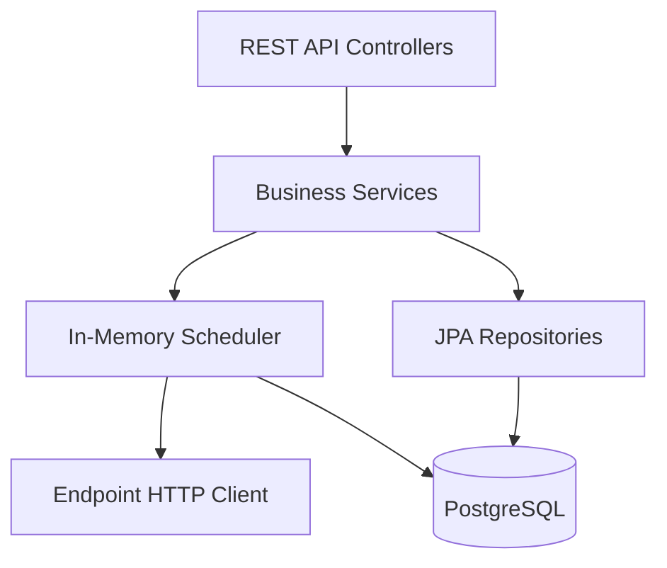

# SLA Ping Monitor

SLA Ping Monitor — это сервис для мониторинга доступности HTTP-эндпоинтов и сбора метрик
по SLA. Проект реализован как Spring Boot приложение на Kotlin и предоставляет REST API
для управления эндпоинтами, папками, а также статистикой проверок.

## Возможности

- Регистрация и управление HTTP-эндпоинтами для проверки доступности.
- Планировщик регулярных проверок и хранение результатов.
- Сводная статистика по эндпоинтам за заданное окно времени.
- Управление backend-нoдами (heartbeat, метрики).
- Встроенные health/metrics эндпоинты Spring Boot Actuator.

## Стек

- Kotlin + Spring Boot 3.5
- Spring Data JPA + PostgreSQL
- Ktor client для выполнения HTTP-проверок
- MapStruct для маппинга сущностей

## Структура репозитория

- `apps/backend` — основное backend-приложение (Spring Boot).
- `contracts` — контракты/спецификации (заготовка).
- `deploy` — материалы для деплоя (заготовка).

## Контекстная диаграмма

```mermaid
flowchart LR
    Users[Пользователи/клиенты] -->|REST API| Backend[SLA Ping Monitor (Spring Boot)]
    Backend -->|CRUD/метрики| Database[(PostgreSQL)]
    Backend -->|HTTP-проверки| Targets[HTTP эндпоинты]
    Backend -->|Health/Metrics| Observability[Actuator/Monitoring]
```

## Компонентная диаграмма



## Требования

- JDK 21
- PostgreSQL 16 (по умолчанию используется локальный `postgres/postgres`)

## Быстрый старт

1. Поднимите PostgreSQL локально или измените настройки подключения в
   `apps/backend/src/main/resources/application.yml`.
2. Запустите приложение:

```bash
./gradlew :apps:backend:bootRun
```

Приложение стартует на `http://localhost:8080`.

## Основные эндпоинты

Примеры запросов доступны в файле
`apps/backend/src/main/resources/local.http` (совместимо с IntelliJ HTTP Client).

- `POST /api/endpoints` — создать эндпоинт.
- `GET /api/endpoints` — список эндпоинтов.
- `GET /api/endpoints/{id}/stats?windowSec=900` — статистика по окну.
- `POST /api/nodes/heartbeat` — heartbeat backend-ноды.

## Метрики и здоровье

Actuator эндпоинты:

- `GET /actuator/health`
- `GET /actuator/metrics`
